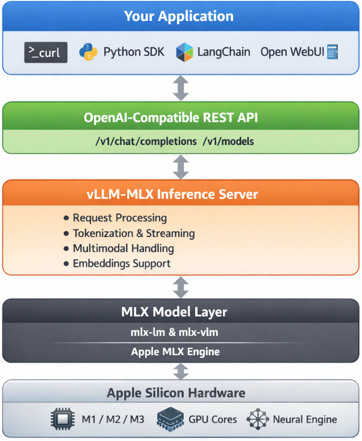

# Running vLLM-MLX on Apple Silicon

Want to run modern LLMs locally — with an OpenAI-compatible API, multimodal support, and strong performance on Apple Silicon? This beginner-friendly guide walks you through everything from installation to your first inference request.

No prior ML experience required.

---

## What is vllm-mlx?

`vllm-mlx` is a community-driven inference server built specifically for Apple Silicon Macs. It uses **MLX**, Apple's machine learning framework designed for M-series chips, and exposes an OpenAI-compatible HTTP API so you can drop it in wherever you'd use the OpenAI SDK.

Think of it as a full, self-contained AI server stack that runs entirely on your Mac.

### How does it differ from official vLLM?

| Feature | vLLM (official) | vllm-mlx |
|---|---|---|
| Backend | CUDA (NVIDIA GPUs) | MLX (Apple Silicon) |
| Platform | Linux + NVIDIA | macOS + Apple Silicon |
| Multimodal support | Limited | Built-in (vision, audio, embeddings) |
| API compatibility | OpenAI | OpenAI + Anthropic |
| Architecture | Plugin-based | Standalone framework |
| Built on | vLLM engine internals | `mlx-lm`, `mlx-vlm` |

**Important:** `vllm-mlx` is not a plugin or fork of official vLLM. It's a separate framework built from the ground up for Macs.

---

## Why use vllm-mlx?

It's the right tool if you want:

- A full-featured local AI server on Apple Silicon
- Text and multimodal inference in a single server
- OpenAI-compatible APIs out of the box
- Fully offline inference — no cloud, no data leaving your machine

---

## System requirements

- macOS with Apple Silicon (M1/M2/M3/M4)
- Python 3.10+
- 16 GB RAM minimum recommended (larger models require more)

---

## Step 1 — Create a clean Python environment

Never install ML tooling into your global Python. Use an isolated virtual environment:

```bash
python3 -m venv ~/.venv-vllm-mlx
source ~/.venv-vllm-mlx/bin/activate
```

Once activated, your shell prompt should change to something like:

```
(venv-vllm-mlx) yourname@macbook %
```

Alternatively, with `virtualenv`:

```bash
virtualenv venv-vllm-mlx
source venv-vllm-mlx/bin/activate
```

---

## Step 2 — Install vllm-mlx

```bash
pip install vllm-mlx
```

Verify the installation:

```bash
pip list | grep vllm
```

You should see `vllm-mlx` in the output.

---

## Step 3 — Start your first model server

We'll use a 4-bit quantized Llama 3.2 model — small, fast, and a good starting point.

```bash
vllm-mlx serve mlx-community/Llama-3.2-3B-Instruct-4bit --port 8010
```

This command will:

1. Download the model from HuggingFace (first run only)
2. Load it into the MLX backend
3. Start an HTTP API server on port 8010

You'll see log output showing the model loading and the server starting on `0.0.0.0:8010`.

---

## Step 4 — Verify the server

### Health check

```bash
curl -s http://localhost:8010/health | jq .
```

Expected output:

```json
{
  "status": "healthy",
  "model_loaded": true,
  "model_name": "mlx-community/Llama-3.2-3B-Instruct-4bit",
  "model_type": "llm",
  "engine_type": "simple",
  "mcp": null
}
```

### List available models

```bash
curl -s http://localhost:8010/v1/models | jq .
```

Expected output:

```json
{
  "object": "list",
  "data": [
    {
      "id": "mlx-community/Llama-3.2-3B-Instruct-4bit",
      "object": "model",
      "created": 1772701579,
      "owned_by": "vllm-mlx"
    }
  ]
}
```

---

## Step 5 — Send a chat request

Use the OpenAI-compatible `/v1/chat/completions` endpoint:

```bash
curl -s http://127.0.0.1:8010/v1/chat/completions \
  -H "Content-Type: application/json" \
  -d '{
    "model": "mlx-community/Llama-3.2-3B-Instruct-4bit",
    "messages": [
      {"role": "user", "content": "Hello! What is the capital of Greece?"}
    ],
    "max_tokens": 100
  }' | jq .
```

Expected response:

```json
{
  "id": "...",
  "object": "chat.completion",
  "choices": [
    {
      "message": {
        "role": "assistant",
        "content": "The capital of Greece is Athens."
      }
    }
  ]
}
```

You're now running a local LLM server on your Mac.

---

## Running larger models (advanced)

For high-memory Macs (64 GB+ recommended), you can run much larger models with additional flags:

```bash
vllm-mlx serve Qwen/Qwen3.5-35B-A3B-GPTQ-Int4 \
  --port 8010 \
  --max-tokens 262144 \
  --reasoning-parser qwen3

```

| Flag | Purpose |
|---|---|
| `--max-tokens 262144` | Sets a large context window (256k tokens) |
| `--reasoning-parser qwen3` | Enables Qwen-specific reasoning output format |

---

## What you can do next

With your local server running, you can connect it to the broader AI tooling ecosystem by pointing any OpenAI-compatible client at `http://localhost:8010/v1`:

- **[Open WebUI](https://github.com/open-webui/open-webui)** — browser-based chat UI
- **[LangChain](https://python.langchain.com/)** or **[LlamaIndex](https://www.llamaindex.ai/)** — agent and RAG pipelines
- **OpenAI Python SDK** — just set `base_url="http://localhost:8010/v1"`
- **Embeddings and multimodal models** — swap in a different model and the same API applies

---

## Architecture overview

When you run `vllm-mlx serve`, you get a layered system:



```
Your App (curl / SDK / WebUI)
        ↓
OpenAI-Compatible API Layer
  /v1/chat/completions, /v1/models, /health, ...
        ↓
vllm-mlx Core Server
  Request validation, tokenization, generation loop,
  streaming, multimodal routing, embeddings
        ↓
MLX Model Layer
  Quantized model weights, forward passes,
  Apple GPU acceleration, unified memory management
        ↓
Apple Silicon Hardware
  M-series GPU + CPU sharing the same memory pool
```

### Why Apple Silicon works so well here

On a discrete GPU setup (NVIDIA), model weights must be copied over PCIe from system RAM to VRAM before inference can begin. Apple Silicon eliminates this bottleneck entirely — the CPU and GPU share the same unified memory pool. Combined with Apple's high memory bandwidth, this makes MLX extremely efficient for inference on models that fit in RAM.

### Multimodal routing

When using a vision or audio model, the server adds an extra routing step:

```
Image / Audio input
        ↓
Multimodal Router (mlx-vlm / audio pipeline)
        ↓
LLM reasoning
        ↓
Text output
```

No additional services are required — it's built into the same server process.

### How vllm-mlx differs from official vLLM under the hood

```
Official vLLM:   App → vLLM Engine → CUDA kernels → NVIDIA GPU
vllm-mlx:        App → vllm-mlx Server → MLX tensors → Apple GPU
```

These are entirely different acceleration stacks. vllm-mlx doesn't use or depend on any CUDA code.

---

*That's it. A local, fully offline, OpenAI-compatible LLM server running natively on your Mac.*

